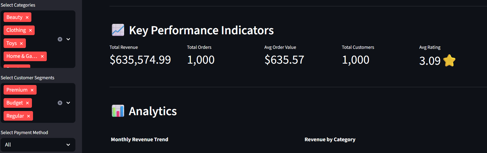
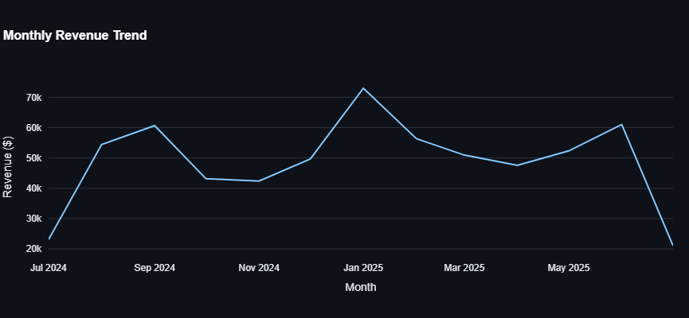
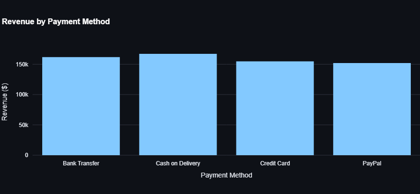
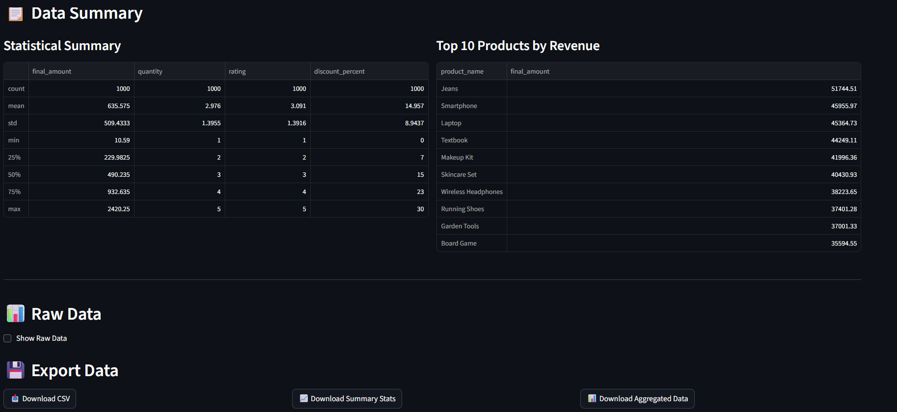

# E-commerce Dashboard

A comprehensive **E-commerce Dashboard** built with [Streamlit](https://streamlit.io/), [Pandas](https://pandas.pydata.org/), [NumPy](https://numpy.org/), and [Plotly](https://plotly.com/). This interactive web application generates a synthetic dataset to simulate e-commerce sales data, offering insights into revenue trends, customer segments, product performance, and payment methods through dynamic visualizations and filters.

[Explore the live dashboard here](ADD_YOUR_STREAMLIT_URL_HERE)!

## Table of Contents
- [Overview](#overview)
- [Features](#features)
- [Screenshots](#screenshots)
- [Installation](#installation)
- [Usage](#usage)
- [Dataset](#dataset)
- [Deployment](#deployment)
- [Contributing](#contributing)
- [License](#license)

## Overview
The E-commerce Dashboard is designed to help business analysts and e-commerce managers explore and analyze sales data. It generates a synthetic dataset of e-commerce transactions and provides interactive visualizations, filters, and data export options. The dashboard includes key performance indicators (KPIs), revenue trends, category performance, and raw data exploration, all accessible through a user-friendly interface.

## Features
- **Interactive Visualizations**: Includes line charts, bar charts, pie charts, and data tables powered by Plotly.
- **Dynamic Filters**: Filter data by date range, category, customer segment, payment method, and minimum rating using sidebar controls.
- **Key Performance Indicators (KPIs)**: Displays total revenue, total orders, average order value, total customers, and average rating.
- **Data Export**: Download filtered data, summary statistics, and aggregated data as CSV files with timestamps.
- **Data Summary**: View statistical summaries and top-performing products.
- **Raw Data Access**: Toggle to display the full filtered dataset.

## Screenshots
Below are screenshots of the E-commerce Dashboard:

### KPIs and Filters

*Displays key performance indicators and sidebar filters.*

### Revenue Trends

*Shows monthly revenue trends over time.*

### Category and Segment Performance

*Illustrates revenue by category and customer segment.*

### Payment Method Distribution

*Displays revenue distribution by payment method.*

### Data Summary and Export

*Includes statistical summaries, top products, and export options.*

*Note*: Replace the placeholder screenshot paths (`screenshots/*.png`) with actual screenshot files in your repository's `screenshots/` folder.

## Installation
To run the dashboard locally, follow these steps:

1. **Clone the Repository**:
   ```bash
   git clone https://github.com/AvazAsgarov/streamlit-credit-risk-dashboard.git
   cd streamlit-credit-risk-dashboard
   ```

2. **Install Dependencies**:
   Ensure you have Python 3.8+ installed, then install the required packages:
   ```bash
   pip install -r requirements.txt
   ```

3. **Run the Application**:
   Launch the Streamlit app:
   ```bash
   streamlit run e_commerce_dashboard.py
   ```
   The dashboard will open in your default web browser.

## Usage
1. **Access the Live App**: Visit [ADD_YOUR_STREAMLIT_URL_HERE](ADD_YOUR_STREAMLIT_URL_HERE) to explore the dashboard online.
2. **Adjust Filters**: Use the sidebar to set a date range, select categories, customer segments, payment methods, and minimum ratings.
3. **Apply Filters**: Click the "Apply Filters" button to update the dashboard with your selections.
4. **Explore Sections**:
   - **KPIs**: View real-time performance metrics.
   - **Analytics**: Analyze revenue trends, category performance, customer segments, and payment methods.
   - **Data Summary**: Check statistical summaries and top products.
   - **Raw Data**: Toggle to view the filtered dataset.
5. **Export Data**: Download CSV files for filtered data, summary statistics, or aggregated data.

## Dataset
The dashboard generates a synthetic dataset with the following features:
- **Order Details**: Order ID, order date, quantity, unit price, total amount, discount percent, discount amount, final amount, shipping cost.
- **Product Information**: Category, product name.
- **Customer Data**: Customer ID, customer segment.
- **Transaction Details**: Payment method, rating.
- **Temporal Data**: Generated over the past year from the current date.

The dataset uses realistic distributions (e.g., uniform for prices, random for dates) and includes calculated fields like final amount and discounts.

## Deployment
This dashboard is deployed using [Streamlit Community Cloud](https://streamlit.io/cloud). Access the live app at [ADD_YOUR_STREAMLIT_URL_HERE](ADD_YOUR_STREAMLIT_URL_HERE). The deployment is managed directly from this GitHub repository, requiring only the Python script (`e_commerce_dashboard.py`) and `requirements.txt`.

## Contributing
Contributions are welcome! To contribute:
1. Fork the repository.
2. Create a new branch (`git checkout -b feature/your-feature`).
3. Make your changes and commit (`git commit -m "Add your feature"`).
4. Push to the branch (`git push origin feature/your-feature`).
5. Open a pull request.

Please ensure your code follows PEP 8 guidelines and includes relevant tests.

## License
This project is licensed under the MIT License. See the [LICENSE](LICENSE) file for details.
